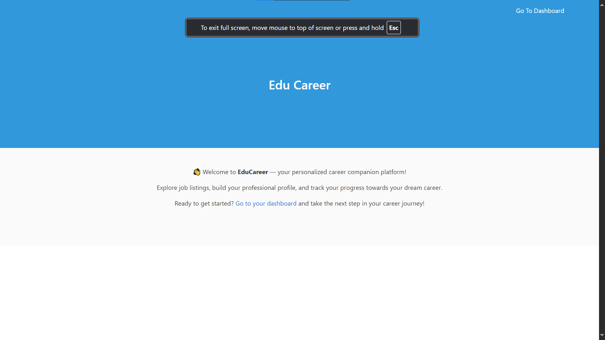
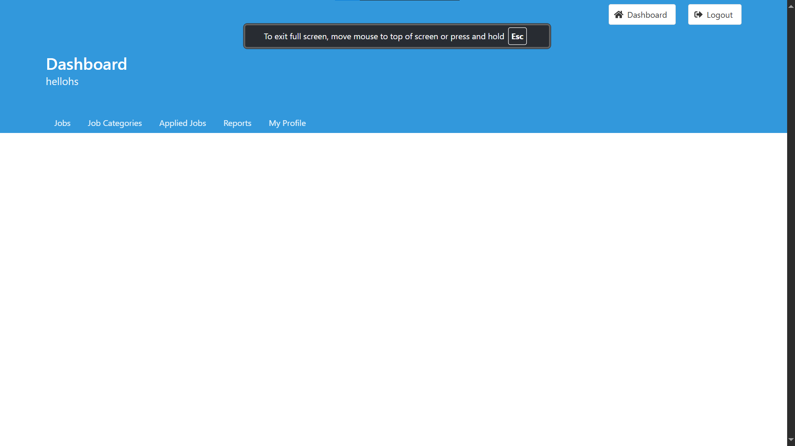

# 🧑‍💼 EduCareer - Web Career & Job Portal

A modern career and job portal web application built with PHP and MySQL. It enables users to sign up as job seekers or employers, apply for jobs, post job listings, and manage their career profiles. Admins can manage users and track system activity.

---

## 📌 Features

### 👤 User Roles
- **Employee (Job Seeker)**: Browse jobs, apply, manage profile.
- **Employer (Recruiter)**: Post jobs, review applications.
- **Admin**: Manage users, monitor system usage.

### 🔑 Authentication
- Login / Signup with email & username
- Forgot password flow (coming soon)
- Session management and access control

### 🧰 Core Modules
- Job Listings by category
- Job Application tracking
- User Profile Management
- Reports & System Logs
- Responsive navigation bar based on user role

---

## 🛠️ Tech Stack

| Tech          | Description                         |
|---------------|-------------------------------------|
| PHP (v7.4+)    | Server-side scripting              |
| MySQL         | Relational database                |
| PDO           | Secure database abstraction        |
| HTML5/CSS3    | Markup and styling                 |
| Bulma CSS     | Responsive UI framework            |
| FontAwesome   | Icons                              |
| JS (minimal)  | Basic interactivity                |

---

## 🚀 Getting Started

### 🔧 Prerequisites
- [XAMPP / LAMP / MAMP](https://www.apachefriends.org/index.html)
- PHP 7.4+
- MySQL 5.7+
- Git

### 📥 Installation


```bash
# 1. Clone the repository
git clone https://github.com/YOUR_USERNAME/career-portal.git
cd career-portal

# 2. Import the database
# Open phpMyAdmin and import: sql/init/1-tables.sql

# 3. Configure DB credentials
# Update the credentials in: model/Database.php

# 4. Start your server
# Place the project inside your xampp/htdocs or your public_html folder

📁 Project Structure:

career-portal/
├── controller/         # Business logic
├── model/              # Database models
├── sql/                # DB schema
├── templates/          # Reusable UI components
├── view/               # HTML views
├── assets/             # CSS, images, JS
├── index.php           # Entry point (front controller)
└── README.md


👀 Screenshots:

Dashboard


Login Page


Job Dashboard


Applied Jobs


🛡️ Security Considerations:

Uses PDO with prepared statements (SQL injection protected).
Session-based authentication.
Input sanitization using filter_var().

🧪 Testing Credentials:
Use this to log in and test--

Username: hellohs
Email: hellouser@comp353.com
Password: hellogs@1234


💡 To Do / Roadmap:

 Forgot password implementation
 Admin analytics dashboard
 Email verification system
 Pagination for job listings


 🤝 Contributing:

Fork the repository
Create your feature branch (git checkout -b feature/thing)
Commit your changes (git commit -am 'Add feature')
Push to the branch (git push origin feature/thing)
Create a Pull Request


📜 License:

This project is open-source and available under the MIT License.


🙋‍♂️ Author:

Made with ❤️ by Gautam Suthar

---

## 🧷 Optional Files to Add

- `screenshots/login.png`, `screenshots/dashboard.png` – take screenshots from your browser and save them inside a `screenshots` folder.
- `LICENSE` – add an MIT license or another as per your preference.
- `.gitignore` – to ignore `vendor`, `.vscode`, etc.

---

Let me know if you'd like me to prepare a working `README.md` file or commit it to your project!
